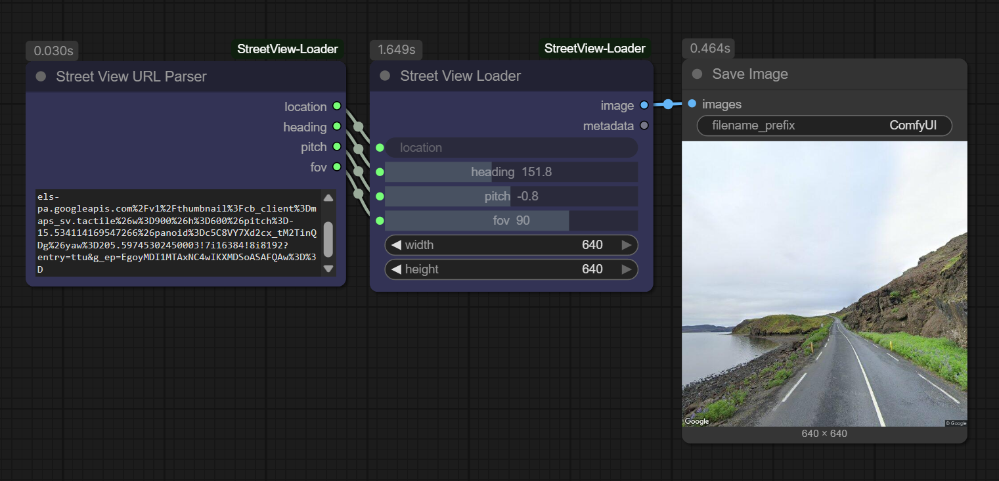
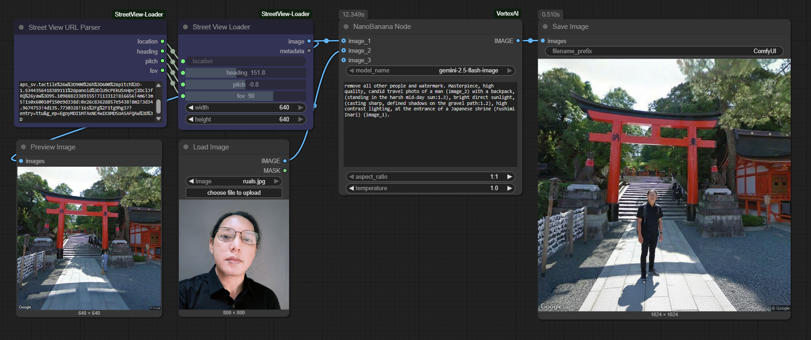
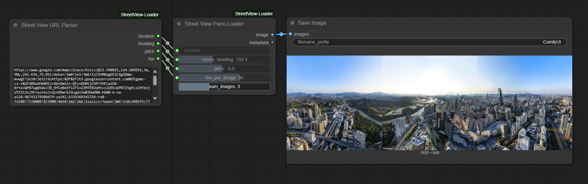

# ComfyUI Street View Loader Node

[](https://opensource.org/licenses/MIT)
[](https://www.python.org/downloads/release/python-3120/)


A custom node for ComfyUI that allows you to load images directly from Google Street View to use as backgrounds, textures, or inputs in your workflows.

Instead of manually taking screenshots, this node programmatically fetches a clean, high-resolution image from any location on Earth with Street View coverage, giving you precise control over the camera angle, direction, and field of view.



---

## Why Use This Node? The Power of "Ground Truth"

While standard text-to-image models are incredible at *imagining* locations ("a charming street in Paris"), they struggle to recreate the **exact appearance and layout** of a specific, real-world place. Their output is an approximation, an artistic blend of countless images.

This node solves that problem by providing **photographic ground truth**. It pulls the real, pixel-for-pixel view of a location, ensuring your generations are anchored in reality.

This gives you the best of both worlds: the authenticity of a real photograph combined with the creative power of AI.

### Key Advantages & Use Cases

*   **Guaranteed Location Accuracy:** When you need the background to be recognizably *your* street, a specific landmark, or a favorite travel spot, this node is the only way to guarantee a 100% accurate representation.
*   **The Ultimate Base for ControlNet:** Feed the real Street View image into your workflow as a base for stylization (anime, oil painting), re-imagining (futuristic, historical), or precise inpainting.
*   **Virtual Location Scouting:** Instantly scout real-world locations from your desktop and experiment with different styles and moods for your project.
*   **Personalized & Sentimental Art:** Create unique art based on a place with personal meaning—a childhood home, a proposal spot, or a favorite vacation view.
*   **Consistent Backgrounds for Testing:** Use a consistent, real-world background to reliably test LoRAs, IPAdapters, or character models.



## Features
- **Direct API Integration:** Pulls images directly from the Google Street View Static API.
- **Easy Workflow with URL Parser:** Just find a spot on Google Maps and paste the URL.
- **Secure API Key Storage:** Uses a `.env` file to keep your API key safe and out of your workflow files.
-   **Simple Aspect Ratio Presets:** Choose from common ratios like 16:9 or 1:1 without manual calculations.
- **Clean Output:** No UI overlays, just the pure image.
- **(Experimental) Panorama Mode:** Stitch multiple images together to create ultra-wide cinematic landscapes.

---

## 1. Installation

1.  Navigate to your ComfyUI `custom_nodes` directory:
    ```bash
    cd ComfyUI/custom_nodes/
    ```

2.  Clone this repository:
    ```bash
    git clone https://github.com/ru4ls/ComfyUI_StreetView-Loader.git
    ```

3.  Install the required Python dependencies. Open a terminal, navigate to the new `ComfyUI_StreetView-Loader` folder, and run:
    ```bash
    pip install -r requirements.txt
    ```
    *(This will install the `requests` and `python-dotenv` libraries required for the node to function.)*

4.  **Restart ComfyUI.**

---

## 2. Setup: Getting Your Google API Key (Crucial Step)

This node requires a Google Cloud API key to function. Google provides a generous **$200/month free credit**, which is more than enough for extensive personal use without any charge.

### Step-by-Step Guide

**Part A: Create Project & Enable API**
1.  Go to the [Google Cloud Console](https://console.cloud.google.com/).
2.  Create a **New Project**. Give it a name like `ComfyUI-API`.
3.  In the new project, search for "API Library".
4.  In the library, search for and **Enable** the **"Street View Static API"**.

**Part B: Set Up Billing**
5.  You will be prompted to link a billing account. This is required, but you will **not be charged** unless you exceed the $200 free monthly credit.

**Part C: Create and Secure Your API Key**
6.  In the Cloud Console search bar, navigate to **"Credentials"**.
7.  Click **"+ Create Credentials"** and select **"API key"**.
8.  **Copy this key immediately.**
9.  **(IMPORTANT!)** Click **"Edit API key"**. Under "API restrictions," select **"Restrict key"** and add **"Street View Static API"** to the list. This protects your account. Click **"Save"**.

**Part D: Configure the Node**
10. In your `ComfyUI/custom_nodes/ComfyUI_StreetView-Loader/` folder, create a new file named `.env` (or rename the existing `.env.example` file).
11. Open this `.env` file and add your copied API key in the following format:
    ```
    GOOGLE_STREET_VIEW_API_KEY="your_actual_api_key_goes_here"
    ```
12. Save the file. Your setup is now complete!

---

## 3. How to Use & Upscaling

The recommended workflow is to use the **URL Parser** node to feed information into the **Loader** node.

1.  **Find your view** in [Google Maps](https://maps.google.com) and enter Street View.
2.  Frame the perfect shot, then **copy the entire URL** from your browser's address bar.
3.  In ComfyUI, add the **`Street View URL Parser`** node and paste the URL into it.
4.  Add the **`Street View Loader`** node.
5.  Connect the outputs of the Parser to the inputs of the Loader (`location` to `location`, etc.).

### Understanding the Nodes and Image Size Limit

#### `Street View URL Parser`
This node takes a full Google Maps URL as input and outputs the camera parameters (`location`, `heading`, `pitch`, `fov`).

#### `Street View Loader`
This is the main node that fetches the image.
-   **`aspect_ratio`**: Choose your desired output aspect ratio from the dropdown. This replaces manual width/height inputs.
-   **API Limit & Upscaling:** The Google Street View API has a maximum output size of **640x640 pixels**. For high-resolution images (like 1080p or 4K), you **must** use an upscaling workflow.
-   **Recommended HD Workflow:**
    1.  Select `"16:9 Widescreen (640x360)"` in the `Street View Loader`.
    2.  Connect its `IMAGE` output to an **`Upscale Image (using model)`** node.
    3.  Use a `Load Upscale Model` node (e.g., `4x-UltraSharp`) to get a final, high-quality **2560x1440** image.

---

## 4. (Experimental) Panoramic Loader Node

For users who need to create wide, cinematic landscapes, the project includes an experimental **Street View Pano Loader** node.



### What It Does
This node overcomes the API's FOV limitations by fetching multiple image "tiles" and stitching them side-by-side. For example, requesting **3 images** will result in three `640x640` images being stitched into a single `1920x640` image.

### **⚠️ Important Experimental Notes:**

-   **API Usage:** This node makes multiple API calls. A panorama with **3 images** will count as **3 requests** against your free monthly Google Cloud credit.
-   **Simple Stitching:** This feature uses a basic side-by-side stitch and does not perform advanced perspective correction. It works best for distant landscapes where distortion is minimal.
-   **Resolution:** The output image will be very wide but only 640px tall. It is highly recommended to chain the output of this node into an **Upscale Image** node.

---

## 5. Troubleshooting

-   **`ValueError: API key not found`:** Your `.env` file is missing, in the wrong location, or the variable name is not `GOOGLE_STREET_VIEW_API_KEY`.
-   **Black Image Output:** This usually means Google has no Street View imagery for that coordinate, or your API key is invalid/restricted. Check your key's restrictions on the Google Cloud Console.
-   **Node not appearing in ComfyUI:** Ensure you have fully restarted the ComfyUI server after installation.

---

## License

This project is licensed under the MIT License - see the [LICENSE](LICENSE) file for details.